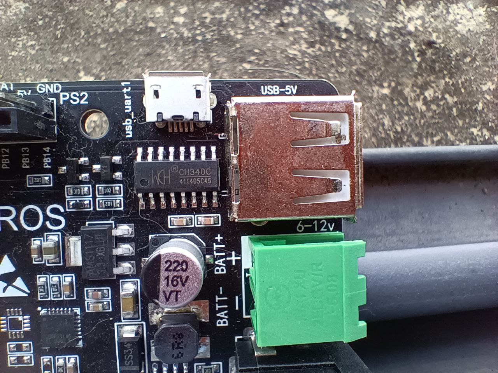

### CH340C CHIP and ubuntu 22.04


လက်ရှိ ubuntu က 22.04.3 LTS
kernel version က 6.2.0-33-generic
kernel version kernal 5.4.0-87 နဲ့ အထက်မှာ ch340 driver တွေအလုပ််မလုပ်။
ဒါကြောင့် ch340 chip ကို သုံးထားတဲ့ brltty display ကို remove လုပ်ပေးဖို့လိုပါတယ်။
```
sudo apt remove brltty 
```

https://learn.sparkfun.com/tutorials/how-to-install-ch340-drivers/linux
